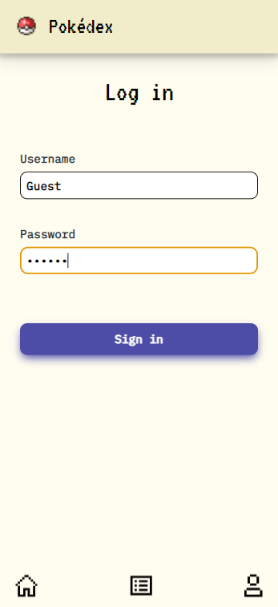
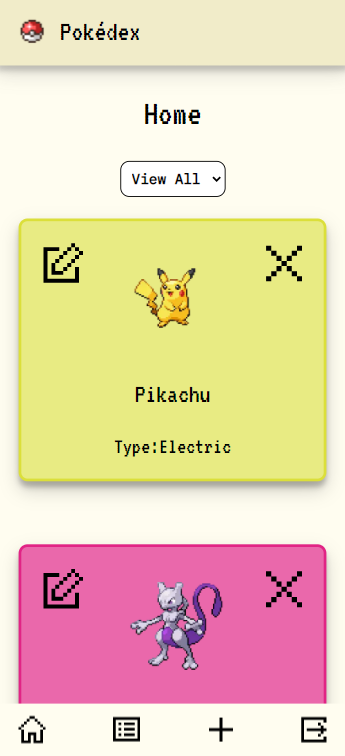
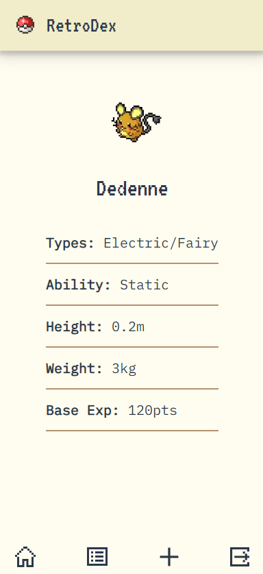
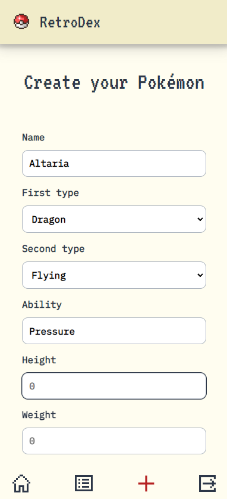
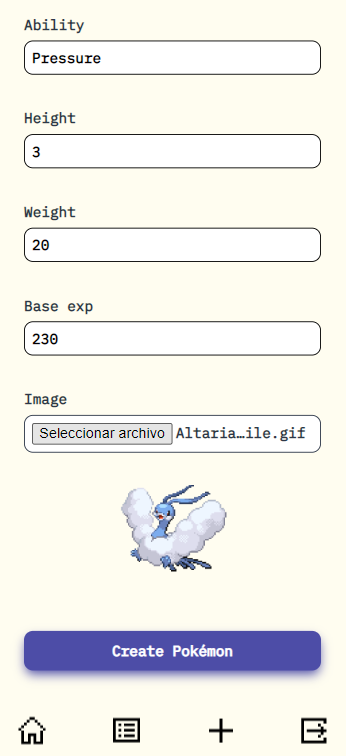

## **RetroDex**

RetroDex goes beyond a simple Pokémon CRUD. Dive into nostalgia with this web application that blends the charm of classic Pokémon games with the convenience of modern technology. Designed with captivating retro aesthetics, RetroDex allows you to create and customize your own Pokémon, explore a growing collection of creatures made by fellow users, and delete them as you please.

Built with cutting-edge technologies like **Next.js** and **Typescript**, RetroDex ensures a seamless and responsive experience.

With a robust pipeline implemented through **GitHub Actions** and **Husky Hooks**, RetroDex enforces consistency in commits and branches, conducts thorough testing, maintains clean code practices, and generates reports via SonarCloud. This ensures the protection of the main branch and the overall integrity of the codebase.

RetroDex is backed by a comprehensive testing suite, covering every feature with **Jest**, **Testing Library** and **MSW** to ensure performance and reliability. From crafting custom Pokémon to diving into meticulous details, RetroDex offers an immersive and user-friendly experience.

Feel free to leave any suggestions! You can email me at **cristinajmartin98@gmail.com**

[Visit RetroDex](https://custom-pokedex-next.netlify.app/)

### **FEATURES**

- Add Pokémon data and image
- Delete your Pokémon
- See all Pokémon created on the app
- See Pokémon details
- Filter by all 18 Pokémon types
- Login authentication using JSON Web Token

### **STACK**

- Frontend Framework: Next.js with TypeScript
- Styling Library: Styled Components
- Testing Library: React Testing Library and Jest
- Authentication: JSON Web Token (JWT)
- Version Control: Git

### **INCOMING FEATURES**

- Edit your already created Pokémon
- Pagination
- Display all 1000+ already existing Pokémon on Home page
- Filter by generation on Home page

### **GET STARTED**

To use this app, you'll need to have the following tool installed:

**[Node.js](https://nodejs.org/en/)**

Once installed, you can run **`git clone`** to clone the repository into your local folder and install all dependencies running **`npm install`**

You can start the development server by running **`npm run dev`** and visiting **`http://localhost:3000/`** in your web browser.

You can see your production build by running **`npm run build`**, deploying it with **`npm start`** and visiting same port as development build in your browser

### **TESTING**

This app uses Jest and React Testing Library for unit and integration tests. To run all test suites, use the **`npm test`** command. If u want your test to be runned everytime you save, use **`npm run test:dev`**. If you want to see your coverage, use **`npm run test:coverage`**
