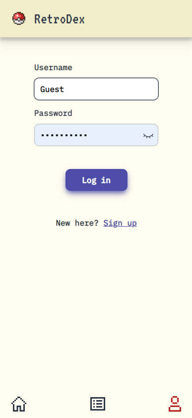

## **POKÉDEX**

Pokédex is a web CRUD application with a toy-like retro style, that allows users to create and delete their own Pokémon, view a total list of Pokémon on the app, and view detailed information for each one. The application uses modern technologies such as Next.js, Typescript and Redux Toolkit for state management. It is deployed on Netlify for easy access by users. It is covered with a 100% by tests using Jest and React Testing Library

Overall, Pokédex is an efficient and user-friendly web application that is made for video game and Pokémon enthusiasts.

[Visit Pokedex](https://custom-pokedex-next.netlify.app/)




### **FEATURES**

- Add Pokémon data and image
- Delete your Pokémon
- See al Pokémon created on the app
- See all Pokémon details
- Filter by all 18 Pokémon types
- Login authentication using JSON Web Token

### **STACK**

- Frontend Framework: Next.js with TypeScript
- Styling Library: Styled Components
- Testing Library: React Testing Library and Jest
- Authentication: JSON Web Token (JWT)
- Version Control: Git

### **INCOMING FEATURES**

- Edit your already created Pokémon
- Pagination
- Display all 1000+ already existing Pokémon on Home page
- Filter by generation on Home page

### **GET STARTED**

To use this app, you'll need to have the following tool installed:

- **[Node.js](https://nodejs.org/en/)**

Once installed, you can clone this repository and install all needed dependencies by using the following commands:

```
git clone

```

On your code editor:

```

npm install

```

You can start the development server by running **`npm run dev`** and visiting **`http://localhost:3000/`** in your web browser.

You can see your production build by running **`npm run build`**, deploying it with **`npm start`** and visiting same port as development build in your browser

### **TESTING**

This app uses Jest and React Testing Library for unit and integration tests. To run all test suites, use the **`npm test`** command. If u want your test to be runned everytime you save, use **`npm run test:dev`**. If you want to see your coverage, use **`npm run test:coverage`**
